<p align="center">
  
</p>

<p align="center">
  <b>Suis Claude Code depuis ton iPhone pendant qu'il travaille sur ton Mac.</b><br>
  Live Activity, Dynamic Island, widget, notifications et Siri. Sans compte développeur payant.
</p>

<p align="center">
  <a href="https://github.com/LucasOtw/Claude-Pulse/actions/workflows/ci.yml"></a>
  
  
  
  
  
  
</p>

<p align="center">
  <a href="#fonctionnalités">Fonctionnalités</a> ·
  <a href="#comment-ça-marche">Comment ça marche</a> ·
  <a href="#installation">Installation</a> ·
  <a href="#options">Options</a> ·
  <a href="#confidentialité">Confidentialité</a> ·
  <a href="#limites-connues">Limites</a>
</p>

<br>

<table>
  <tr>
    <td align="center" width="50%">
      <br>
      <sub><b>Écran verrouillé</b> · tâche en cours, demande d'autorisation, fin</sub>
    </td>
    <td align="center" width="50%">
      <br>
      <sub><b>L'app</b> · limites, surveillance, sessions en cours</sub>
    </td>
  </tr>
</table>

## Fonctionnalités

<table>
  <tr>
    <td width="50%" valign="top">
      <h4>Live Activity façon suivi de course</h4>
      Ce que fait Claude en ce moment (« Modifie contact.html », « Lance les tests »), l'étape de sa liste (3/5), le temps restant estimé, les sous-agents actifs. La limite de 5 h avance comme une course Uber.
    </td>
    <td width="50%" valign="top">
      <h4>Dynamic Island</h4>
      En compact : l'état et le compte à rebours. En grand : le détail complet. Thème noir, blanc ou automatique.
    </td>
  </tr>
  <tr>
    <td valign="top">
      <h4>Valider depuis l'iPhone</h4>
      Quand Claude demande une autorisation, réponds <b>Autoriser</b> ou <b>Refuser</b> depuis la Live Activity, sans ouvrir l'app. Les commandes sensibles restent réservées au Mac.
    </td>
    <td valign="top">
      <h4>Notifications utiles</h4>
      Tâche terminée (avec ce qui a été fait), accord nécessaire, limite à 80 %, remise à zéro, erreur. Une seule alerte par événement, même avec dix sessions ouvertes.
    </td>
  </tr>
  <tr>
    <td valign="top">
      <h4>Usage et limites</h4>
      Limites 5 h et 7 jours, tokens par jour, par modèle et par projet, avec leur équivalent au tarif de l'API. Touche la jauge pour le détail.
    </td>
    <td valign="top">
      <h4>Détail de chaque session</h4>
      Sous-agents et ce qu'ils font, workflow et ses phases, contexte utilisé, journal des dernières actions, tokens de la session.
    </td>
  </tr>
  <tr>
    <td valign="top">
      <h4>Widget</h4>
      Écran d'accueil et écran verrouillé : limites, sessions en cours.
    </td>
    <td valign="top">
      <h4>Siri et Raccourcis</h4>
      « Dis Siri, où en est Claude Pulse ? » · « Dis Siri, limite de Claude Pulse ».
    </td>
  </tr>
</table>

### Des notifications qui disent quelque chose

<p align="center">
  
</p>

Le récapitulatif (fichiers modifiés, commandes, sous-agents) est calculé sur le Mac à partir du transcript de la session. Seuls les noms de fichiers et des nombres partent.

## Comment ça marche

<p align="center">
  
</p>

1. Des **hooks Claude Code** et la **status line** envoient au serveur ce qui se passe : outil utilisé, étape, sous-agents, limites.
2. Le **serveur** (fonctions Vercel + Upstash Redis, plans gratuits) reconstruit l'état de chaque session.
3. L'**app iPhone** l'interroge toutes les 5 s pendant une tâche (20 s sinon), met à jour la Live Activity et envoie les notifications.

> [!NOTE]
> **Pourquoi ça marche sans compte développeur payant.** Sans compte payant, pas de push Apple : le serveur ne peut pas réveiller l'iPhone. C'est donc l'app qui reste éveillée écran verrouillé, grâce à deux filets :
> - un **son silencieux** en boucle, qui se mélange à ta musique sans la couper et se relance tout seul après un appel ou une alarme ;
> - la **localisation en arrière-plan**, approximative (sans GPS). La position n'est ni enregistrée ni envoyée. Une pastille bleue s'affiche en haut de l'écran. Désactivable dans Réglages → « Rester active ».
>
> Avec [ntfy](#options) (gratuit), les notifications arrivent même quand l'app est fermée.

## Confidentialité

Les scripts du Mac n'envoient que des **métadonnées**. Le filtre est lisible dans [`mac/hook.sh`](mac/hook.sh).

| Envoyé | Jamais envoyé |
| --- | --- |
| Nom du dossier du projet, nom de l'outil | Le texte de tes prompts |
| **Nom** du fichier lu ou modifié (sans son chemin) | Les réponses de Claude * |
| Description courte d'une commande ou d'un sous-agent | Les commandes elles-mêmes * |
| Domaine d'une page web, intitulés des tâches, nom des workflows | Le contenu des fichiers |
| % de contexte, % des limites, nombre de tokens | Ta position |

<sub>* Sauf options que tu actives toi-même : la validation à distance envoie la commande à autoriser, le résumé de fin de tâche envoie la première phrase de la réponse.</sub>

## Installation

Compte environ 20 minutes. Il te faut un Mac avec Xcode, un iPhone et un compte Vercel gratuit.

### 1 · Serveur sur Vercel

1. Sur Vercel : **Add New → Project** → importe ce dépôt → **Root Directory : `backend`** → Deploy.
2. Onglet **Storage** du projet → **Upstash for Redis** (Marketplace, plan *Free*) → connecte-le au projet. Les variables `KV_REST_API_URL` et `KV_REST_API_TOKEN` sont ajoutées automatiquement.
3. **Settings → Environment Variables** → ajoute `PULSE_TOKEN` avec un secret au hasard (`openssl rand -hex 32`).
4. **Redeploy**, puis vérifie :
   ```bash
   curl -H "Authorization: Bearer TON_PULSE_TOKEN" https://TON-PROJET.vercel.app/api/state
   ```

### 2 · Mac (Claude Code)

```bash
jq --version || brew install jq     # jq est inclus dans macOS 15+
cd mac
./install.sh https://TON-PROJET.vercel.app TON_PULSE_TOKEN
```

Le script copie les scripts dans `~/.claude/claude-pulse/` (config en `chmod 600`), ajoute les hooks dans `~/.claude/settings.json` après une sauvegarde, pour **tous tes projets**, et installe la status line :

```
[Opus] · ctx 42% · 5h 23% · 7j 41% · $1.23
```

Si tu avais déjà une status line, elle continue de s'afficher. Relance tes sessions Claude Code. Pour tout retirer : `./uninstall.sh`.

### 3 · App iPhone

1. Dans Xcode : **Réglages → Comptes → +** → connecte ton Apple ID (gratuit).
2. Sur l'iPhone : **Réglages → Confidentialité et sécurité → Mode développeur** → activer (l'iPhone redémarre).
3. Sur le Mac :
   ```bash
   brew install xcodegen
   cd ios
   ./setup.sh https://TON-PROJET.vercel.app TON_PULSE_TOKEN
   ```
   Le script écrit `ios/Shared/PulseSecrets.swift` (ignoré par git), génère `ClaudePulse.xcodeproj` et l'ouvre.
4. Dans Xcode, pour les cibles **ClaudePulse** et **ClaudePulseWidgets** : *Signing & Capabilities* → **Team** = ton *Personal Team*. Une seule fois : `update.sh` la retient ensuite. Si Xcode refuse le bundle ID, remplace `com.lucasotw` dans `project.yml` et relance `./setup.sh`.
5. Branche l'iPhone, choisis-le comme destination, **Run** (⌘R).
6. Au premier lancement, iOS bloque l'app : **Réglages → Général → VPN et gestion de l'appareil** → ton Apple ID → **Faire confiance**.
7. Dans l'app : **Lancer la surveillance** → accepte les notifications et la localisation (« Lorsque l'app est active ») → verrouille l'iPhone.
8. Ajoute le widget : appui long sur l'écran d'accueil → **+** → *Claude Pulse*.

### Mettre à jour

```bash
~/claude-pulse/update.sh     # puis ⌘R dans Xcode
```

Récupère la dernière version, met à jour les scripts Claude Code, régénère le projet Xcode en gardant ton équipe de signature et l'ouvre. Une modification faite par erreur dans Xcode est mise de côté (`git stash list`) au lieu de casser le build. Le serveur se redéploie tout seul sur Vercel à chaque push sur `main`.

## Options

<details>
<summary><b>Notifications même app fermée (ntfy, gratuit)</b></summary>
<br>

1. Installe l'app **ntfy** sur l'iPhone.
2. Choisis un nom de sujet impossible à deviner (`openssl rand -hex 12`) et abonne-toi à ce sujet dans ntfy.
3. Ajoute `NTFY_TOPIC` avec ce nom dans les variables Vercel, puis redéploie.

Le serveur envoie alors lui-même : accord nécessaire, tâche terminée, erreur, limite 5 h à 80 %, limite atteinte et remise à zéro (programmée à l'avance chez ntfy). Elles arrivent aussi sur l'Apple Watch. Plusieurs sessions arrêtées par la même limite ne donnent qu'une notification, et un même message n'est jamais renvoyé dans les 2 minutes. L'app n'envoie plus ses propres notifications pour éviter les doublons.

</details>

<details>
<summary><b>Valider depuis l'iPhone</b></summary>
<br>

Allume l'interrupteur « Valider depuis l'iPhone » dans l'app quand tu t'éloignes du Mac. Quand Claude Code demande une autorisation, la demande s'affiche dans l'app et sur la Live Activity, avec les boutons **Autoriser** et **Refuser**.

- Éteint, rien ne change : le terminal pose sa question comme d'habitude.
- Allumé, Claude attend ta réponse 3 minutes au plus, puis le terminal reprend la main.
- Les commandes sensibles (`rm -rf`, `sudo`, `git push --force`, `git reset --hard`, `curl … | sh`, `npm publish`…) ne peuvent jamais être autorisées depuis le téléphone, seulement refusées.
- L'interrupteur s'éteint tout seul au bout de 12 h.
- Seuls l'outil et la commande, le fichier ou l'URL partent, jamais le contenu d'un fichier.

Pour désactiver complètement : `PULSE_REMOTE_APPROVAL=0` dans `~/.claude/claude-pulse/config`.

</details>

<details>
<summary><b>Résumé de fin de tâche</b></summary>
<br>

Avec `PULSE_SUMMARY=1` dans `~/.claude/claude-pulse/config`, la notification « terminé » commence par la première phrase de la réponse de Claude (« J'ai corrigé le formulaire de contact. »). Désactivé par défaut, puisque ça envoie un bout de texte au serveur.

</details>

<details>
<summary><b>Fuseau horaire</b></summary>
<br>

Les jours (tokens du jour, heures des notifications) sont comptés à l'heure de Paris. Pour un autre fuseau : variable `PULSE_TZ` dans Vercel, par exemple `America/Montreal`.

</details>

<details>
<summary><b>Rythme des relevés</b></summary>
<br>

- Mac (`~/.claude/claude-pulse/config`) : `PULSE_HEARTBEAT=30` (secondes entre deux battements pendant un même outil), `PULSE_USAGE_EVERY=60` (relevé de l'usage).
- iPhone : `activeInterval` / `idleInterval` dans [`LiveMonitor.swift`](ios/ClaudePulse/LiveMonitor.swift).

</details>

## Bon à savoir

- **L'app expire au bout de 7 jours** (règle d'Apple pour les Apple ID gratuits) : rebranche l'iPhone et relance-la depuis Xcode (⌘R) une fois par semaine. Les notifications ntfy, elles, continuent.
- iOS ferme une Live Activity au bout de **8 h** : relance la surveillance le matin.
- Ne ferme pas l'app depuis le sélecteur d'apps : iOS l'arrête alors complètement et la Live Activity affiche « Mise à jour en pause ». Touche-la pour reprendre.
- La surveillance consomme un peu de batterie. Balaie la Live Activity ou touche **Arrêter** quand tu n'en as plus besoin.

## Limites connues

<details>
<summary>Voir les détails</summary>
<br>

- **Phase exacte d'un workflow** : Claude Code n'émet pas d'événement par phase. On affiche le nom du workflow, ses phases déclarées, les sous-agents actifs et le fait qu'il tourne en arrière-plan.
- **Limites 5 h / 7 jours** : fournies par Claude Code uniquement avec un abonnement Pro ou Max, après le premier message d'une session.
- **Coût en dollars** : avec un abonnement, ce n'est pas ce que tu paies. L'app montre seulement l'équivalent au tarif de l'API dans la vue détaillée, pour situer ton usage.
- **Historique des tokens** : compté à partir des transcripts gardés sur le Mac, que Claude Code efface au bout de 30 jours par défaut. Pour garder plus d'historique : `"cleanupPeriodDays": 3650` dans `~/.claude/settings.json`. Les conversations sur claude.ai et l'app mobile ne sont pas comptées.
- **Temps restant** : estimé à partir de la liste de tâches de Claude (durée moyenne des étapes faites × étapes restantes). Il apparaît une fois la première étape terminée, et seulement quand Claude a fait une liste.
- **Widget** : iOS décide de son rythme de rafraîchissement (environ toutes les 5 à 15 min). L'app le force quand un statut change pendant la surveillance.
- **Session interrompue avec Échap** : aucun hook n'est déclenché. Une session sans nouvelles depuis 20 min passe en inactive.

</details>

<details>
<summary>Événements Claude Code utilisés</summary>
<br>

| Événement | Effet |
| --- | --- |
| `UserPromptSubmit` | début d'une tâche (chrono) |
| `PreToolUse` (au plus 1 fois / 30 s, sauf TodoWrite / Agent / Workflow) | ce que fait Claude, progression, nom et phases du workflow |
| `TaskCreated` / `TaskCompleted` | progression de la liste de tâches |
| `SubagentStart` / `SubagentStop` | sous-agents actifs et ce qu'ils font |
| `Notification` (`permission_prompt`…) | notification « accord nécessaire » |
| `PermissionRequest` | validation depuis l'iPhone (si activée) |
| `Stop` | notification « terminé » avec le récapitulatif, si la tâche a duré plus de 30 s |
| `StopFailure` | erreur, limite atteinte |
| status line (1 relevé / min) | % de contexte, limites 5 h / 7 jours |

</details>

<details>
<summary>Quotas gratuits</summary>
<br>

Chaque lecture de l'iPhone coûte 7 commandes Redis, chaque événement du Mac environ 7. Une journée de 8 h de surveillance avec Claude actif la moitié du temps représente environ 15 000 commandes, soit de l'ordre de 300 000 par mois : ça tient dans le plan gratuit d'Upstash. Si tu approches de la limite, augmente `activeInterval` et `PULSE_HEARTBEAT`, ou arrête la surveillance quand tu ne t'en sers pas.

</details>

## Développement

```bash
cd backend && npm test   # serveur : machine à états, alertes, validation, bout en bout (faux Redis, faux ntfy)
./mac/test.sh            # scripts Mac (faux serveur local)
```

Les deux tournent sur GitHub Actions à chaque push.

<details>
<summary>Structure du dépôt</summary>
<br>

```
backend/                  fonctions Vercel, Node sans dépendance
  api/hook.js             événements des hooks → état de la session
  api/usage.js            relevés de la status line, alertes de limite
  api/state.js            lu par l'app et le widget (1 requête Redis)
  api/session.js          détail d'une session
  api/stats.js            tokens et équivalent API
  api/tokens.js           tokens par session, calculés sur le Mac
  api/approval.js         demandes d'autorisation (côté Mac)
  api/decide.js           réponse depuis l'iPhone
  api/remote.js           interrupteur de validation à distance
  lib/state.js            machine à états (pure, testée)
  lib/alerts.js           quelles notifications envoyer, et leur texte
  lib/approval.js         garde-fous de la validation à distance
  lib/notify.js           envoi via ntfy
  lib/pricing.js          tarifs publics de l'API par modèle
  lib/stats.js            agrégats par jour, période, modèle et projet
  lib/store.js            clés Redis
  lib/redis.js            Upstash REST
ios/
  project.yml             projet XcodeGen
  setup.sh  generate.sh   configuration et génération du projet
  Shared/                 modèles, API, styles, attributs de la Live Activity
  ClaudePulse/            app : surveillance, maintien en arrière-plan, notifications, Siri
  ClaudePulseWidgets/     widget, Live Activity et Dynamic Island
mac/
  hook.sh                 hooks Claude Code (métadonnées seulement)
  statusline.sh           status line + relevé de l'usage
  approve.sh              validation à distance (hook PermissionRequest)
  turn.jq                 récapitulatif du dernier tour pour la notification
  tokens.sh  tokens.jq    tokens d'une session, lus dans son transcript
  backfill.sh             envoie l'historique encore présent sur le Mac
  install.sh  uninstall.sh  test.sh
docs/                     visuels de ce README
update.sh                 met tout à jour sur le Mac
```

</details>

<br>

<p align="center">
  <sub>Projet personnel, non affilié à Anthropic. Claude et Claude Code sont des marques d'Anthropic.</sub>
</p>
